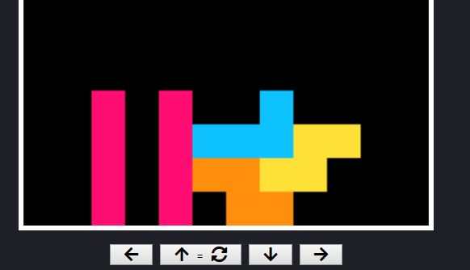

# Desktop tetris game

Website live preview on [this GitHub Page](https://mar1ape.github.io/Tetris/)

Simple tetris game written in JavaScript by following tutorial and personalized by me by adding keys description below active canvas so player knows how to move or rotate dropping blocks (also changed keys to do so from originally proposed in tutorial).

